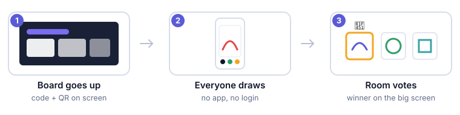

# Draw the Topic

A drawing game for presentation nights, parties and workshops. You put a board
on the big screen, everyone scans a QR code or types a six-character code, draws
the topic on their phone, and the room votes for a favourite.

No app to install, no accounts for players, no build step. The whole game is one
HTML file.

## Which guide do you want?

**[Running a game →](docs/running-a-game.md)**
You have a link to a board and you want to host a night. No technical
knowledge needed: making a board, running rounds, the timer, putting it on the
projector, voting, and saving the drawings.

**[Setting up your own →](docs/setup.md)**
You want to run your own copy with your own database, so you are not depending
on anyone else's. Firebase setup, security rules, configuration and hosting.
Assumes you can copy and paste, not that you can code.

**[How it works →](docs/how-it-works.md)**
What the code is doing and why: the data model, security rules, what is stored
and for how long, and the decisions behind them.

## Quick look

| | |
|---|---|
| **Players need** | a phone and a code. That is all. |
| **Hosts need** | an email and password on whichever copy they are using. |
| **You need, to run your own** | a free Firebase project and somewhere to serve one HTML file. |
| **Cost** | free — it fits inside Firebase's free tier for ordinary use. |

## What it does

- **Drawing** — pen, eraser, shapes, fill, thirteen colours plus a picker, and
  your three most recent colours kept to hand. Pinch or scroll to zoom in for
  detail, two fingers or the move tool to pan.
- **Rounds** — set a topic, run a timer you can pause, clear and restart, then
  open voting and show the results.
- **A screen for the room** — the board goes fullscreen with the topic, timer,
  join code, drawings and winner, and none of your controls.
- **Several presenters** — everyone signs in and gets their own boards, so two
  nights can run side by side without colliding.
- **Nothing kept** — drawings are deleted when the next round starts. Save what
  you want to keep before then.
